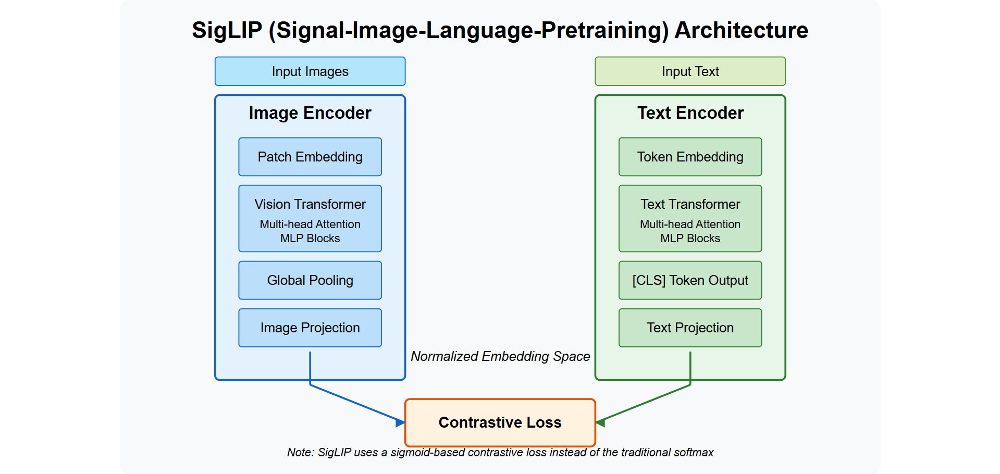

# VLMverse: Vision-Language Model Architectures

<div align="center">

</div>

PyTorch implementations of cutting-edge vision-language models from scratch. Demystifying multimodal AI with clean, educational code and detailed architectural breakdowns.

## Overview

This repository contains a detailed PyTorch implementation of the PaLiGemma vision-language model (VLM). PaLiGemma is a powerful multimodal model that combines Google's Gemma language model with a SigLIP vision encoder, allowing it to understand both images and text to generate contextually relevant responses.

PaLiGemma represents a significant advancement in multimodal AI, enabling complex image understanding and text generation capabilities that can be applied to a wide range of tasks including:
- Visual question answering
- Image captioning
- Visual reasoning
- Multimodal chat

The implementation is based on the [Google's PaLiGemma paper](https://arxiv.org/abs/2312.13256) and demonstrates how to:
- Load the pre-trained PaLiGemma weights from Hugging Face
- Process images and text inputs with proper tokenization
- Generate contextually relevant text based on images and prompts
- Leverage KV-cache for efficient autoregressive inference
- Implement grouped-query attention for computational efficiency

## Architecture

<div align="center">

</div>

PaLiGemma consists of two main components that work together to process multimodal inputs:

1. **Vision Encoder (SigLIP)**: Processes images into embeddings
   - Based on the SigLIP (Sigmoid Loss for Language Image Pre-training) architecture
   - Divides images into 16×16 patches and processes them through a transformer encoder
   - Features a Vision Transformer (ViT) architecture with self-attention layers
   - Generates a sequence of patch embeddings (196 tokens for a 224×224 image)
   - Uses learned positional embeddings rather than fixed position encoding
   - Incorporates layer normalization and residual connections for stable training
   
2. **Language Model (Gemma)**: Generates text based on image embeddings and prompts
   - Decoder-only architecture based on Google's Gemma language model
   - Uses RMSNorm instead of LayerNorm for better training stability
   - Implements GeLU activations for improved performance over ReLU
   - Features Rotary Position Encoding (RoPE) for handling positional information
   - Employs grouped-query attention to reduce computational requirements
   - Implements flash attention and KV-caching for efficient inference

### SigLIP Vision Encoder

<div align="center">

</div>

SigLIP (Sigmoid Loss for Language Image Pre-training) is an improvement over CLIP (Contrastive Language-Image Pre-training) that addresses several limitations of the original CLIP model:

<div align="center">

</div>

Key improvements in SigLIP include:
- Replacing contrastive loss with sigmoid loss for more stable training
- Better handling of hard negatives in the training process
- Improved performance on a wide range of downstream tasks
- More efficient training dynamics and convergence properties
- Enhanced ability to align visual and textual representations

The SigLIP Vision Transformer processes images through these steps:
1. **Patch Embedding**: Divides the image into fixed-size patches (16×16 pixels) and projects each to an embedding space
2. **Position Embedding**: Adds learned positional embeddings to maintain spatial information
3. **Transformer Encoder**: Processes the sequence of patch embeddings through multiple self-attention layers
4. **Layer Normalization**: Applies normalization before each attention block for training stability
5. **Feed-Forward Networks**: Processes embeddings through MLP blocks with GeLU activations

The implementation in `modeling_siglip.py` carefully follows this architecture to ensure faithful reproduction of the original model's capabilities.

### Rotary Position Encoding (RoPE)

<div align="center">

</div>

The model uses Rotary Position Encoding (RoPE) for handling positional information in the sequence. RoPE is a sophisticated position encoding method that offers several advantages over traditional positional embeddings:

- **Relative Position Encoding**: Instead of absolute positions, RoPE encodes relative positions between tokens, making it more effective for capturing relationships in sequences.

- **Mathematical Foundation**: RoPE applies a rotation matrix to query and key vectors in the attention mechanism, with the rotation angle determined by the position and frequency.

- **Implementation Details**:
  - For each dimension pair (2j, 2j+1) in the embedding space, applies a 2D rotation
  - Rotation angle is determined by: θⱼ = 10000^(-2j/d) where d is the dimension
  - Position m is encoded by applying rotation matrix R_θ(m):
    ```
    [cos(mθj)  -sin(mθj)]
    [sin(mθj)   cos(mθj)]
    ```
  - Full formulation for transformed embeddings:
    ```
    q̂m,2j   = qm,2j·cos(mθj) - qm,2j+1·sin(mθj)
    q̂m,2j+1 = qm,2j·sin(mθj) + qm,2j+1·cos(mθj)
    ```

- **Key Advantages**:
  - Enables extrapolation beyond training context length
  - Preserves inner product between rotated vectors based on their relative positions
  - Provides decaying attention spans with frequency
  - More efficient computationally than other position encoding schemes
  - Does not increase sequence length, unlike absolute positional embeddings

In our implementation, RoPE is applied to both query and key vectors in the self-attention mechanism as shown in `modeling_gemma.py`.

### GeLU Activation Function

<div align="center">

</div>

The Gemma model uses the Gaussian Error Linear Unit (GeLU) activation function instead of the traditional ReLU. GeLU has important properties that make it advantageous:

- **Smooth Approximation**: Unlike ReLU's hard cutoff at 0, GeLU provides a smooth transition
- **Probabilistic Interpretation**: Can be interpreted as x multiplied by the probability of x being positive
- **Mathematical Definition**: GeLU(x) = x * Φ(x), where Φ is the cumulative distribution function of the standard normal distribution
- **Approximation Used**: GeLU(x) ≈ 0.5x * (1 + tanh(√(2/π) * (x + 0.044715x³)))
- **Performance Benefits**: Consistently outperforms ReLU in transformer architectures

### Multi-Head Attention with Grouped-Query Attention

Our implementation uses a grouped-query attention mechanism to reduce computational requirements:

```python
# Repeat the key and values to match the number of heads of the query
key_states = self.repeat_kv(key_states, self.num_key_value_groups)
value_states = self.repeat_kv(value_states, self.num_key_value_groups)
```

This technique:
- Uses fewer key-value heads than query heads (num_key_value_heads < num_attention_heads)
- Shares each key-value head across multiple query heads (num_key_value_groups = num_heads / num_key_value_heads)
- Reduces memory requirements and computational cost during inference
- Minimally impacts model quality while significantly improving efficiency

## Repository Structure

- `modeling_gemma.py`: Complete implementation of the Gemma language model and PaLiGemma multimodal architecture
  - Includes KV-cache mechanism for efficient inference
  - Implements RoPE position encoding
  - Contains grouped-query attention implementation
  
- `modeling_siglip.py`: Detailed implementation of the SigLIP vision encoder
  - Vision transformer with patch embedding
  - Self-attention mechanisms for image processing
  - Layernorm and residual connections
  
- `processing_paligemma.py`: Comprehensive image and text processing utilities for PaLiGemma
  - Image resizing, normalization, and tokenization
  - Text preprocessing and tokenization
  - Combined image-text sequence preparation
  
- `inference.py`: Script for running inference with the model
  - Autoregressive text generation
  - Top-p and temperature sampling options
  - Integration with KV-cache for faster generation
  
- `download_paligemma.py`: Script to download the pre-trained PaLiGemma weights from Hugging Face
  
- `launch_inference.sh`: Bash script to easily launch inference with configurable parameters
  
- `utils.py`: Helper functions for loading the model and tokenizer from safetensors format
  
- `rope-position-encoding.mermaid`: Mermaid diagram source for RoPE visualization
  
- `text_images/`: Sample images for testing the model's vision capabilities
  
- `docs/`: Research papers and documentation
  - PaLiGemma paper
  - SigLIP paper
  - RoFormer paper (RoPE)
  - KV Cache documentation
  - Multi-Head Attention explanation
  
- `images/`: Diagrams and visualizations of the architecture

## Getting Started

### Prerequisites

- Python 3.8+
- PyTorch 2.0+
- Transformers library (latest version recommended)
- 8GB+ RAM for inference (16GB+ recommended)
- GPU with 8GB+ VRAM for faster inference

### Installation

1. Clone the repository:
   ```bash
   git clone https://github.com/yourusername/vlmverse.git
   cd vlmverse
   ```

2. Install the required dependencies:
   ```bash
   pip install torch transformers pillow safetensors fire numpy
   ```

3. Download the pre-trained model weights:
   ```bash
   python download_paligemma.py
   ```
   Note: This will download approximately 6GB of model weights from Hugging Face.

### Running Inference

You can use the provided script to run inference:

```bash
bash launch_inference.sh
```

Or run the Python script directly with more control over parameters:

```bash
python inference.py \
    --model_path "paligemma_weights" \
    --prompt "this building is known as" \
    --image_file_path "text_images/monument.jpeg" \
    --max_tokens_to_generate 100 \
    --temperature 0.8 \
    --top_p 0.9 \
    --do_sample True
```

Parameters explained:
- `model_path`: Path to the downloaded model weights
- `prompt`: Text prompt to start generation
- `image_file_path`: Path to the image file to analyze
- `max_tokens_to_generate`: Maximum number of tokens to generate
- `temperature`: Controls randomness (higher = more random)
- `top_p`: Controls diversity via nucleus sampling
- `do_sample`: Whether to sample from the probability distribution
- `only_cpu`: Force CPU inference even if GPU is available

## Implementation Details

### Image Processing Pipeline

The implementation processes images through these detailed steps:
1. **Loading**: Opens the image file using PIL and converts to RGB format
2. **Resizing**: Resizes to match the model's expected dimensions (224×224 pixels) using bicubic interpolation
3. **Normalization**:
   - Scales pixel values from [0, 255] to [0, 1]
   - Applies ImageNet mean (0.5, 0.5, 0.5) and standard deviation (0.5, 0.5, 0.5)
   - Transforms to the format expected by the vision encoder
4. **Patch Extraction**: Divides the 224×224 image into 196 patches of 16×16 pixels
5. **Vision Processing**: Processes through the SigLIP encoder to generate embeddings
6. **Projection**: Maps vision embeddings to the language model's dimension space

Key image processing code:
```python
def process_images(
    images: List[Image.Image],
    size: Dict[str, int] = None,
    resample: Image.Resampling = None,
    rescale_factor: float = None,
    image_mean: Optional[Union[float, List[float]]] = None,
    image_std: Optional[Union[float, List[float]]] = None,
) -> List[np.ndarray]:
    height, width = size[0], size[1]
    images = [
        resize(image = image, size = (height, width), resample = resample) for image in images
    ]
    # Convert to numpy, rescale and normalize
    images = [np.array(image) for image in images]
    images = [rescale(image = image, scale = rescale_factor) for image in images]
    images = [normalize(image = image, mean = image_mean, std = image_std) for image in images]
    # Move channels first for PyTorch
    images = [image.transpose(2, 0, 1) for image in images]
    return images
```

### Text Integration and Token Processing

The model combines image and text through a sophisticated process:

1. **Image Token Preparation**:
   - Image features are extracted and projected to the language model's dimension
   - 196 image tokens (one per patch) are prepared for insertion into the sequence

2. **Text Tokenization**:
   - The prompt text is tokenized using the Gemma tokenizer
   - A beginning-of-sequence (BOS) token is added, followed by the prompt and a newline token
   - Special handling for bounding box tokens and segmentation tokens when needed

3. **Sequence Combination**:
   - Image tokens are placed at the beginning of the sequence
   - Text tokens follow the image tokens
   - Attention masks are properly set to allow the model to attend to both modalities

4. **Processing Flow**:
   ```
   Visual input (224×224 RGB)
   ↓
   SigLIP Vision Encoder (196 patch embeddings)
   ↓
   Projection Layer (adjust dimensions)
   ↓
   Combine with tokenized text prompt
   ↓
   Process through Gemma decoder layers
   ↓
   Generate output tokens autoregressively
   ```

5. **KV-cache Utilization**:
   - During generation, key-value pairs from previous steps are cached
   - New tokens only need to be processed with cached keys and values
   - Dramatically speeds up autoregressive generation

### Key Innovations

1. **KV-Cache Implementation**: 
   - Stores key-value pairs from previous decoding steps to avoid redundant computation
   - Reduces inference time complexity from O(n²) to O(n) for sequence length n
   - Implementation in the `KVCache` class handles efficient tensor management:
   ```python
   def update(self, key_states, value_states, layer_idx):
       if len(self.key_cache) <= layer_idx:
           self.key_cache.append(key_states)
           self.value_cache.append(value_states)
       else:
           self.key_cache[layer_idx] = torch.cat([self.key_cache[layer_idx], key_states], dim=-2)
           self.value_cache[layer_idx] = torch.cat([self.value_cache[layer_idx], value_states], dim=-2)
       return self.key_cache[layer_idx], self.value_cache[layer_idx]
   ```

2. **Multi-Head Attention with Grouped-Query Attention**:
   - Reduces computational load by using fewer key-value heads than query heads
   - Each key-value head is shared across multiple query heads
   - Implementation in `GemmaAttention` class optimizes tensor operations:
   ```python
   def repeat_kv(hidden_states: torch.Tensor, n_rep: int) -> torch.Tensor:
       batch, num_key_value_heads, slen, head_dim = hidden_states.shape
       if n_rep == 1:
           return hidden_states
       hidden_states = hidden_states[:, :, None, :, :].expand(batch, num_key_value_heads, slen, n_rep, head_dim)
       return hidden_states.reshape(batch, num_key_value_heads * n_rep, slen, head_dim)
   ```

3. **RMSNorm for Layer Normalization**:
   - Improves training stability compared to traditional LayerNorm
   - Uses root mean square instead of mean and variance
   - More efficient computation with better numerical properties:
   ```python
   def _norm(self, x):
       return x * torch.rsqrt(x.pow(2).mean(-1, keepdim=True) + self.eps)
   ```

4. **Efficient Attention Implementation**:
   - Uses flash attention patterns where possible
   - Optimizes tensor operations for GPU execution
   - Careful masking and scaling for numerical stability

5. **Vision-Language Integration**:
   - Sophisticated token insertion and attention masking strategy
   - Proper handling of modality boundaries
   - Efficient projection between vision and language representation spaces

## Performance Considerations

- **Memory Usage**: The model requires ~6GB of VRAM for the 3B parameter version
- **Inference Speed**: KV-caching significantly improves generation speed
- **Batch Processing**: The implementation supports batched inference for multiple images
- **Quantization**: The model can be quantized to reduce memory footprint
- **CPU vs GPU**: GPU inference is ~10-20x faster than CPU inference

## References

- [PaLiGemma Paper](https://arxiv.org/abs/2312.13256): "PaLiGemma: Learning with Unified Multimodal Pathway in Vision Language Models"
- [Gemma: Open Models Based on Gemini Research and Technology](https://blog.google/technology/developers/gemma-open-models/)
- [From CLIP to SigLIP](https://arxiv.org/abs/2303.15343): "SigLIP: Sign-to-Likelihood Supervision Improves Contrastive Language-Image Pre-training"
- [RoFormer: Enhanced Transformer with Rotary Position Embedding](https://arxiv.org/abs/2104.09864)
- [Flash Attention](https://arxiv.org/abs/2205.14135): "FlashAttention: Fast and Memory-Efficient Exact Attention with IO-Awareness"
- [Grouped-Query Attention](https://arxiv.org/abs/2305.13245): "GQA: Training Generalized Multi-Query Transformer Models from Multi-Head Checkpoints"

## License

This project is provided for educational purposes only. The model weights and architecture are subject to Google's model license.

---

Created with ❤️ by Harsh 
